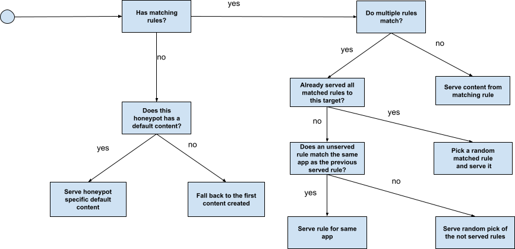

# Detailed Description
## Components

Lophiid is build out of the following components:

  

The backend contains all the business logic and honeypots connect via the
internet using gRPC (SSL client certs). The backend interacts with the postgres
database and also write payloads it got from attacks to disk.

The API server interacts with the database and allows the CLI and UI to view and
interact with the data collected from the honeypots. When the API server makes
some changes to the database (e.g. it adds a rule) then it might take a few minutes
before the backend server acts on the change due to caching (for performance).
The CLI and UI use HTTPS with an API key to interact with the API server.

The honeypots are super simple agents and rely on the backend for almost
anything. Two special cases are that the backend can tell the honeypot to send
an ICMP ping package to a host and the backend can tell the honeypot to download
malware. All this communication is done via gRPC.

AI is used for analysing incoming requests and generating realistic responses.

## Rule based content serving

The most basic operation with lophiid is to create static content and tie it to
a rule. The rule can have all kinds of conditions which a request needs to meet
before the content is served.

If the request matches multiple rules then each time the same request is seen
(and this can be across multiple honeypots, as longs as the source IP is the
same) a previously not served content is served. If one of the not served
content has the same application ID as a rule that was served prior to
the attacker then this rule will get priority.

Now "content" can be static but it can also be a script (JavaScript). If it's a
script than then that script gets executed and gets access to the matching
request. The script can then parse the request and define the response the
honeypot needs to send back.  For example, some payloads want the target to echo
a random string and so the script could parse the string from the request and
echo it back to the requester.  More information about scripted responses found
[here](./SCRIPTING.md).

Last but not least, there is some templating funtionalities with macros that
allow random strings to be generated for things like session cookies and csrf
tokens.  Having these static is often a dead give away to attackers that they
deal with a honeypot.

When a request matches no rule at all then the honeypot will send a
default response which is configurable per honeypot.

A general overview of rule matching is presented in the image below:

  

## Request processing

The backend analyses requests for possible payload URLs and downloads these via
the honeypots. The downloaded content is uploaded and scanned with VirusTotal
(optional) using the free API quota anyone can get.

More information about payload fetching can be found here: [Payload fetching](./PAYLOAD_FETCHING.md)

The backend also looks for ping requests that are send by an attacker. These may
seem innocent but are occasionally uses in high profile attacks where the
attacker monitors DNS lookups and incoming ICMP to see if a payload executed. If
a ping command is detected then the backend will tell the origin honeypot to
perform the ping request. This is done using raw sockets.

Additionally the backend will perform whois lookups of the source IPs and also,
if configured, collects OS fingerprinting information from p0f instances running
on the honeypot systems. All this information is available in the UI.

## AI / LLM integration

Lophiid can use an LLM for three purposes:

- Generating realistic responses
- Triaging the incoming requests
- Creating summaries

Small descriptions are below but for more information about the AI integration, look at [./AI.md](./AI.md).
Any remote or local LLM provider who has an OpenAI compatible API can be used.

### Generating realistic responses

Lophiid can use a local LLM to help it with creating the best response
for an attack. For example, say an attacker want to exploit a remote command
execution vulnerability but you can not anticipate up front what commands will
be executed during the attack: lophiid will use the LLM to create example
command outputs that match with what the attacker has send.

This results in lophiid responses that look more realistic than, for example,
typical honeypot responses thata have only a few hardcoded responses.

NOTE: This is a very experimental feature. Be aware that using AI-generated responses in a honeypot system may have security implications. Use with caution and ensure you understand the risks before enabling this feature in a production environment.

### Triaging incoming requests

When enabled, a local LLM will be used to triage incoming requests. The AI will
try to determine for each request whether it is malicious, what type of weakness
is exploited, what application is targetted and, although this is currently
unstable, what CVE is being abused. The LLM will also create a description of
the attack which makes it easier for humans to review it in the web UI.

NOTE: This is a very experimental feature. Be aware that using AI-generated responses in a honeypot system may have security implications. Use with caution and ensure you understand the risks before enabling this feature in a production environment.

### Creating summaries

Lophiid uses Yara rules to analyze malware. These rules can sometimes create a
lot of output and we use the LLM to summarize this output in the UI.
Additionally the LLM is used to summarize each request and provides a
description about whether the request is malicious and what its purpose is.

## Queries and labels

In the UI you can store queries for two purposes. First it can just be handy to
have a long query stored for future use. Second, it is possible to attach labels
to queries in which case the backend will regularly run this query and apply
those labels to any request that matched the query.  You can also search for such
labels in the Requests tab of the web UI.

For example, you could make a query that tries to find all `curl` commands and
then apply the label `curl` to those requests. Once done you can go to the UI and
search with `label:curl` and find such requests.

This way of tagging might be subject to change in the future where tagging might
be moved to the Rule logic of lophiid for performance reasons.

## UI and CLI

Lophiid comes with a UI for managing the backend and analyzing all honeypot
interactions. A core part of the UI is a search ability on all different data
types lophiid handles (documented [here](./SEARCH.md).

Below is an example page of the UI:

The CLI is currently limited but can be used to easily copy content (and
create rules for) of public web sites. More information about how to use the CLI
can be found [here](./API_CLIENT.md).

## Yara scanning

Yara scanning is done by a separate process and optional. The process monitors
the malware downloads entries in the database and will scan each malware entry
with the configured yara rules. The results are then stored in the database and
surfaced in the UI.

Because yara rules can be noisy, we use the LLM to make small summaries from all
the yara rule output. These are also stored in the database and surfaced in the
UI.
