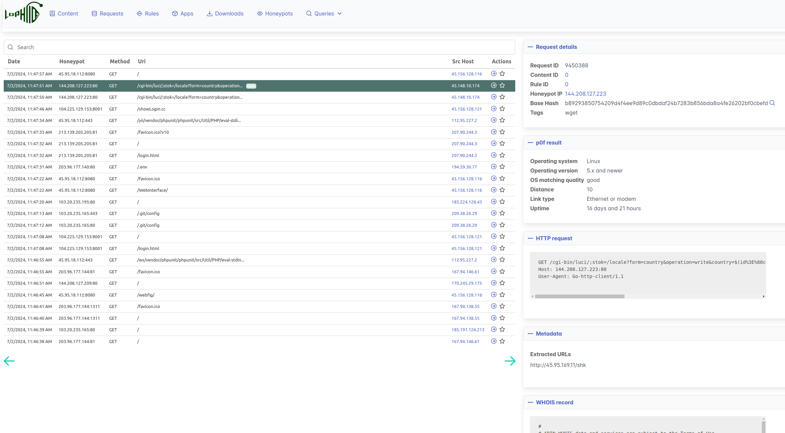
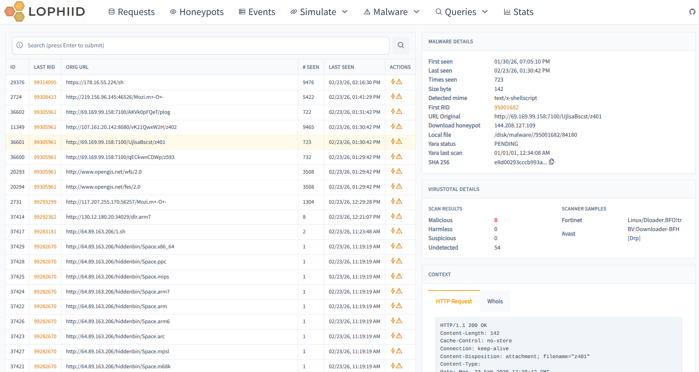

# lophiid

  

## Introduction

Lophiid is a hybrid AI honeypot for detecting and interacting with mass web
application exploitation attempts.

The design of lophiid is that one backend controls multiple honeypot sensors
agents across the web. Each honeypot can be configured individually but the
backend is able to track interactions with attackers across all of them.

Say an attacker scans for / across the internet and it hits 50 lophiid
honeypots. The backend can make sure that during each individual interaction
with a honeypot a different response is sent to the attacker and with that
increases the chance that the attacker gets something they are looking for which
can result in further interaction.

While you can configure Lophiid with static content and rules, you can also make
use of the AI triage and responsing of requests. In that case, AI will determine
what kind of attack is happening and will then involve the right "responder"
(code) with the right AI model to deal with that request.

Key features:

- Hybrid AI honeypot approach
- Highly scalable
- Static, scripted (Javascript) and AI supported response handling
- Alerting possible (Telegram, extensible)
- UI with comprehensive search
- AI analysis of attacks
- Automatic tagging of requests and attacks to help triage
- Automatically malware collection and storage
- Yara (yara-x) integration
- Direct integration with VirusTotal
- Ratelimiting / DoS protection
- Exporting of rules for sharing with the community
- Extensive metrics for prometheus/grafana
- Highly customizable

For more information check out the [Detailed Description](./DETAILED_DESCRIPTION.md) document. To get started, make use of the [Quick Start](./QUICK_START.md) guide.

If you need any assistance, please don't hesitate to open an issue or to reach out to niels.heinen{at}gmail.com.

# Screenshots

Requests page overview which shows all the requests that honeypots are getting.

The downloads page shows information about all the downloaded payloads which
were obtained via attacks. The payloads themselves are also stored locally in
the malware directory (configurable via the backend config).

# Contributing

Contributions are super welcome! Just fork the repo and send us a PR. Please
regularly check the [CONTRIBUTING.md](./CONTRIBUTING.md) for general guidelines

# Documentation

* [Setup guide](./SETUP.md)
* [Detailed Description](./DETAILED_DESCRIPTION.md)
* [Screenshots](./SCREENSHOTS.md)
* [Scripted responses](./SCRIPTING.md)
* [API cli client usage](./API_CLIENT.md)
* [UI search - overview](./SEARCH.md)
* [UI search - all keywords](./SEARCH_KEYWORDS.md)
* [Payload fetching](./PAYLOAD_FETCHING.md)
