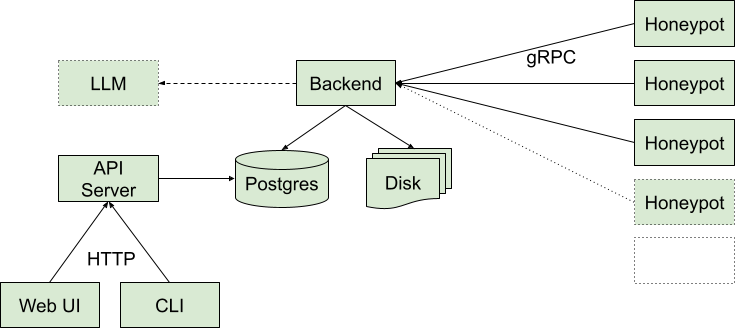

# lophiid

## Introduction

Lophiid is a distributed honeypot for detecting and interacting with mass web
application exploitation attempts.

The design of lophiid is that one backend controls multiple honeypot sensors
agents across the web. Each honeypot can be configured individually but the
backend is able to track interactions with attackers across all of them.

Say an attacker scans for / across the internet and it hits 50 lophiid
honeypots. The backend can make sure that during each individual interaction
with a honeypot a different response is send to the attacker and with that
increases the chance that the attacker gets something they are looking for which
can result in further interaction.

Similarly lophiid can respond differently to multiple command injections against
the same endpoint.

Key features:

- A distributed honeypot approach
- Rule based interactions with attacks
- Support both static and scripted (Javascript) response handling
- Alerting possible (Telegram, extensible)
- UI with comprehensive search
- Automatic tagging of requests and attacks to help triage
- Automatically collects malware
- Direct integration with VirusTotal
- Ratelimiting / DoS protection
- Exporting of rules for sharing with the community
- Extensive metrics for prometheus/grafana
- Highly customizable

Running lophiid is already very interesting and you'll collect a lot of threat
information. The project is still in an early phase of development though and
large changes are still to be expected in the near future.

## Detailed Description
### Components

Lophiid is build out of the following components:

The backend contains all the business logic and honeypots connect via the
internet using gRPC (SSL client certs). The backend interacts with the postgres
database and also write payloads it got from attacks to disk.

The API server interacts with the database and allows the CLI and UI to view and
interact with the data collected from the honeypots. When the API server makes
some changes to the database (e.g. it adds a rule) then it might take a few minutes
before the backend server acts on the change due to caching (for performance).
The CLI and UI use HTTPS with an API key to interact with the API server.

The honeypots are super simple agents and rely on the backend for almost
anything. One special case is that the backend can tell a honeypot for download
malware from an HTTP endpoint that was previously extracted from a request that
hit that same honeypot. The honeypot in this case will download the malware and
send it to the backend using gRPC.

### Rule based content serving

The most basic operation with lophiid is to create static content and tie it to
a rule. The rule can have all kinds of conditions which a request needs to meet
before the content is served.

If the request matches multiple rules then each time the same request is seen
(and this can be across multiple honeypots, as longs as the source IP is the
same) a previously not served content is served.

Now "content" can be static but it can also be a script (JavaScript). If it's a
script than then that script gets executed and gets access to the matching
request. The script can then parse the request and define the response the
honeypot needs to send back.  For example, some payloads want the target to echo
a random string and so the script could parse the string from the request and
echo it back to the requester.

When a request matches no rule at all then the honeypot will send a
default response which is configurable per honeypot.

### Payload downloading

# Documentation

* [Screenshots](./SCREENSHOTS.md)
* [Scripted responses](./SCRIPTING.md)
* [API cli client usage](./API_CLIENT.md)
* [UI search - overview](./SEARCH.md)
* [UI search - all keywords](./SEARCH_KEYWORDS.md)
* [Payload fetching](./PAYLOAD_FETCHING.md)
