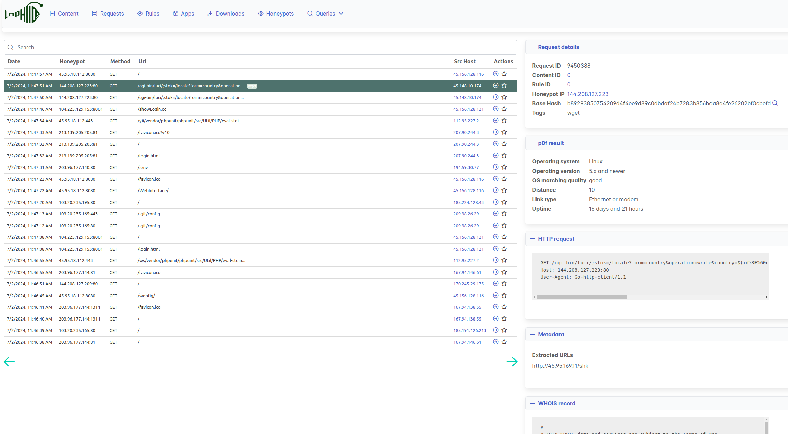
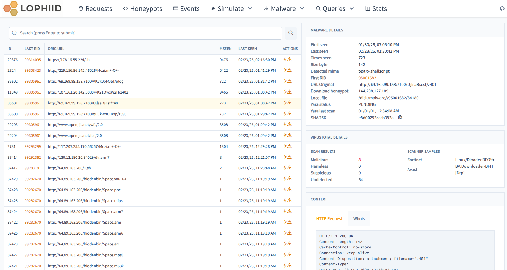

# lophiid

  

## Introduction

Lophiid is a hybrid AI honeypot for detecting and interacting with mass web
application exploitation attempts.

The design of lophiid is that one backend controls multiple honeypot sensors
agents across the web. Each honeypot can be configured individually but the
backend is able to track interactions with attackers across all of them.

While you can configure Lophiid with static content and rules, you can also make
use of the AI triage and responding of requests. In that case, AI will determine
what kind of attack is happening and will then involve the right "responder"
(code) with the right AI model to deal with that request.

For example, if a request is determined to be attempting code injection then the
code injection responder will use AI to try to interpret the code and to
determine what kind of response is expected by the attacker.

Key features:

- Hybrid AI honeypot approach
- AI agent for vulnerability research based rule creation
- Static, scripted (Javascript) and AI supported response handling
- AI specifialized request handlers for:
 - Shell code injection (with persistent session memory/command history)
 - Code injection (with code emulation)
 - File uploading (with multi step request handling)
 - File access (emulates direct access vulns)
 - SQL injection (emulates data leaking)
- Automatic attacker campaign recognition and management
- Alerting possible (Telegram, extensible)
- Desktop and mobile web UI with comprehensive search
- AI analysis of attacks
- Automatic tagging of requests and attacks to help triage
- Automatically malware collection and storage
- Yara (yara-x) integration
- Direct integration with VirusTotal
- Ratelimiting / DoS protection
- Exporting of rules for sharing with the community
- Extensive metrics for prometheus/grafana
- Highly customizable

If you need any assistance, please don't hesitate to open an issue or to reach out to niels.heinen{at}gmail.com.

# Screenshots

Requests page overview which shows all the requests that honeypots are getting.

The downloads page shows information about all the downloaded payloads which
were obtained via attacks. The payloads themselves are also stored locally in
the malware directory (configurable via the backend config).

# Contributing

Contributions are super welcome! Just fork the repo and send us a PR. Please
regularly check the [CONTRIBUTING.md](./CONTRIBUTING.md) for general guidelines

# Documentation

* [Setup guide](./SETUP.md)
* [Detailed Description](./DETAILED_DESCRIPTION.md) - needs updating!!
* [Automatic Campaign recognition](./docs/CAMPAIGNS.md)
* [Geographic tagging](./docs/GEOIPLOCATION.md)
* [Rule generation agent](./docs/AIRULEGENERATION.md)
* [Screenshots](./SCREENSHOTS.md)
* [Scripted responses](./SCRIPTING.md)
* [API cli client usage](./API_CLIENT.md)
* [UI search - overview](./SEARCH.md)
* [UI search - all keywords](./SEARCH_KEYWORDS.md)
* [Payload fetching](./PAYLOAD_FETCHING.md)
