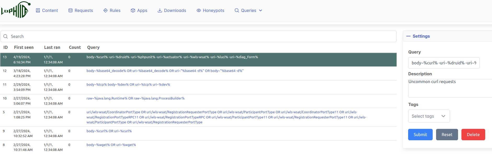
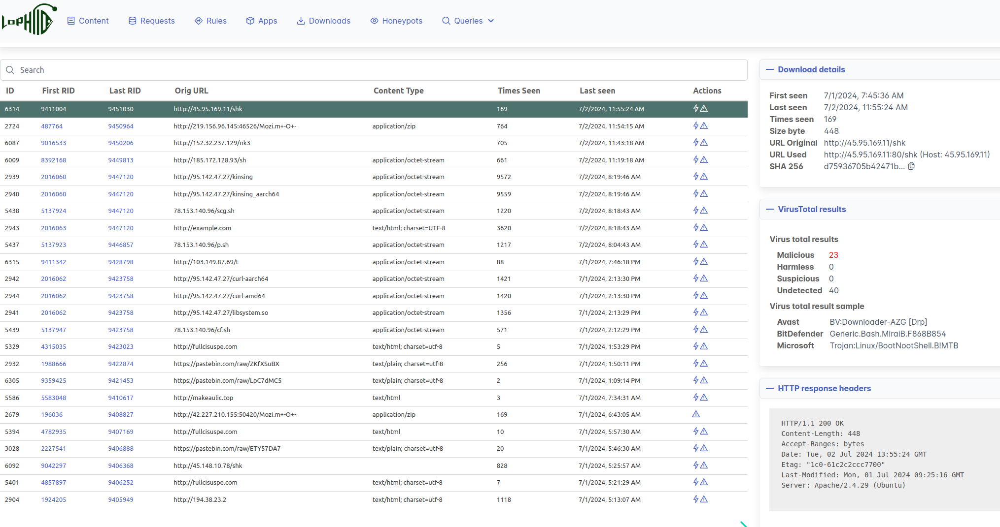

## Requests page
Requests page overview which shows all the requests that honeypots are getting.

## Queries page
The queries page allow you to manage stored queries. These stored queries can be
used for just saving complex queries but additionally you can use them to
continuously apply tags to "requests" (e.g. see the "wget" tag in the above
screenshot)

## Downloads / payloads page
The downloads page shows information about all the downloaded payloads which
were obtained via attacks. The payloads themselves are also stored locally in
the malware directory (configurable via the backend config).

