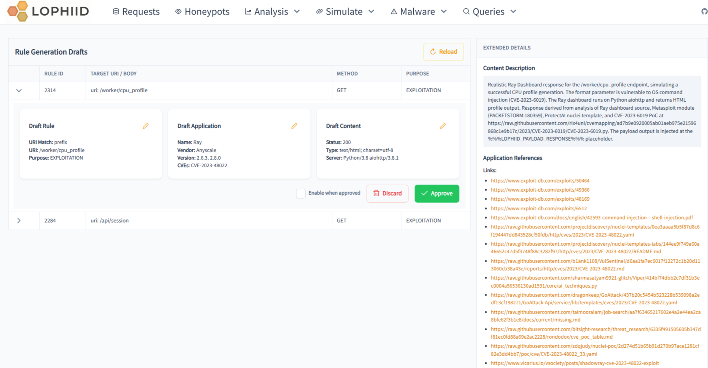

# AI Rule generation

Lophiid includes an AI agent that can be used to generate rules (and all
dependencies) for a request that was send by an attacker.

The agent will look at the request in the database and some of the AI analysis
and triage information that is already there (i.e. payload information). It will
then do web searches for exploit and vulnerability analysis web pages. That
information is then used to understand how the vulnerability works, how the
exploit works and what kind of response exploit tools tend to expect.

With all this information the agent is able to create a draft rule (with
dependencies) that can then be reviewed and approved in the web UI.

## Prepare

There is an example configuration file in
config/rule-generation-agent-config.yaml . You will have to edit this file and
add the database information, your Tavily key, a github personal access token
(this will only be used for search so do not give this permissions) and finally
your LLM API information (key and model).

With regards to selecting an LLM model for this task, you want to want a model
that is good in reasoning, has enough context and is good in tool calling. I
personaly use larger models for this like qwen 235B or even Claude Sonnet.

## Select a request

You can use any request for this and let the agent just do it's job. Just keep
in mind that requests from attackers that do not have a lot of unique
identifiers might result in rules that are too broad. This is something you will
be able to check when reviewing the created rule in the UI though. Just keep it
in mind.

## Running the tool

Running it is very straightforward. Just run it with the following flags (and
replace the request ID with the ID you have found in the Lophiid web UI):

```shell
go run cmd/rule_generation_agent/main.go -c rule-generation-agent-config.yaml  -request-id 105857723
time=2026-04-28T16:06:21.804Z level=INFO msg="Using GitHub token for authenticated access"
.... snip snip...
time=2026-04-28T16:06:28.673Z level=INFO msg="tool: web_search" query="/worker/cpu_profile?pid= format= exploitdb"
time=2026-04-28T16:06:29.759Z level=INFO msg="tool: search_github_code" query="/worker/cpu_profile?pid= format= CVE"
time=2026-04-28T16:06:38.039Z level=INFO msg="tool: fetch_url" url=https://raw.githubusercontent.com/rix4uni/cvemapping/ad7b9e0920005ab01aeb975e21596868c1e9b17c/2023/CVE-2023-6019/CVE-2023-6019.py
time=2026-04-28T16:06:38.255Z level=INFO msg="tool: fetch_url" url=https://raw.githubusercontent.com/protectai/ai-exploits/0df6408cce662cfc953757534ffc521ba13c6aca/ray/nuclei-templates/ray-cpuprofile-cmd-injection.yaml
time=2026-04-28T16:06:38.578Z level=INFO msg="tool: web_search" query="CVE-2023-6019 Ray cpu_profile command injection exploitdb"
time=2026-04-28T16:06:46.177Z level=INFO msg="tool: fetch_url" url=https://nvd.nist.gov/vuln/detail/CVE-2023-6019
time=2026-04-28T16:06:46.780Z level=INFO msg="tool: fetch_url" url="https://sploitus.com/exploit?id=PACKETSTORM:180359"
time=2026-04-28T16:06:46.975Z level=INFO msg="tool: web_search" query="CVE-2023-6019 Ray cpu_profile command injection analysis response"
.... snip snip...
time=2026-04-28T16:07:39.530Z level=INFO msg="tool: create_draft" uri=/worker/cpu_profile method=GET
time=2026-04-28T16:07:39.535Z level=INFO msg="draft created" rule_id=2314 content_id=2439 app_id=204
time=2026-04-28T16:07:50.353Z level=INFO msg="rule creation workflow complete"
.... snip snip...
time=2026-04-28T16:07:50.353Z level=INFO msg="rule generation agent finished successfully" request_id=110891952
```


## Reviewing the result

In the web UI, click on `Simulate` and then click on `Drafts` in the toolbar. Here
you will find all draft rules and you can review and approve them one by one.
Don't forget to either manually enable them OR to select the "Enable when
approved" checkbox.

A screenshot of the UI with draft rules:



Note that on the right of the screenshot you can see all sources that the agent
encountered while searching for information about the vulnerability exploited.


## Monitoring the rule

Now it is key to know whether a rule is actually useful and working. Therefore
by default each rule created this way will have "Monitor killchains" enabled.

All sessions that contained requests that hit this rule will then be analyzed
for kill chains. Detected kill chains are stored in the database and if attacks
end up going deeper into the kill chain after the rule was added then that could
be a strong indication that the rule is a success.
